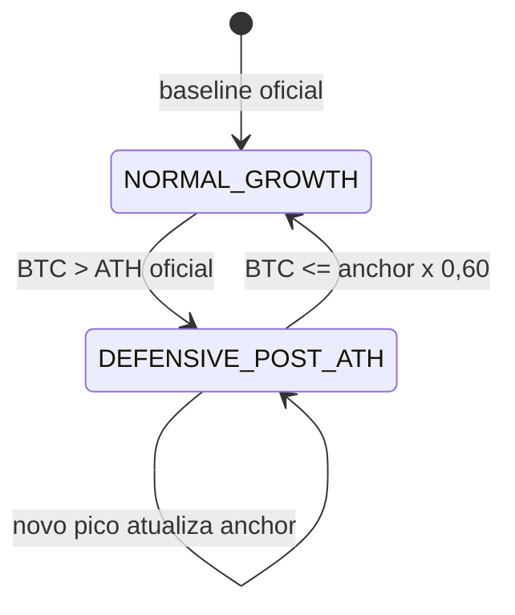

# CoinOps — estratégia oficial a partir de 27/08/2026

## Objetivo

O CoinOps preserva todo o histórico anterior como **legado/pré-baseline** e mede apenas deltas reais posteriores ao timestamp transacional de ativação. Não há backfill de operações, simulação histórica ou projeção patrimonial.

- Data oficial exibida: `27/08/2026`
- Timezone: `America/Campo_Grande`
- Ciclo normal: janela exata `[início, início + 30 dias)`
- BTC: gain configurado no ativo; entrada normal 2%; meta 7
- SOL: gain configurado no ativo; entrada normal 3%; meta 2
- Principais: slots 1–25 habilitados e financiados
- Reserva: posições 26–50 desabilitadas/não financiadas até ativação explícita

## Máquina de estados



### NORMAL_GROWTH

- Espaçamento: BTC 2%, SOL 3%.
- Prioridade: menor progresso do ciclo; menor nível operacional; mais tempo sem operar; menor número do slot.
- Um slot que bate a meta sai da fila enquanto existir outro abaixo.
- Se todos atingirem a meta, novas entradas do ativo pausam até o próximo ciclo.

### DEFENSIVE_POST_ATH

- Espaçamento: BTC 5%, SOL 8%, aplicado somente a novas entradas.
- Metas continuam medidas para relatório, mas não controlam elegibilidade.
- Prioridade: zerados; menor nível; menor saldo; mais tempo sem operar; menor slot.
- Recuperações intermediárias não reativam o defensivo. Somente um novo ATH acima do oficial.

Mudanças de modo não alteram posições já abertas, `entry`, `target`, quantidade ou data de abertura.

## Baseline e ledger do ciclo

O snapshot cobre geral, ativo e slot. Os totais históricos não são zerados. O progresso é derivado exclusivamente de eventos posteriores:

```text
cycle_progress = real_gain + redistribution_in - redistribution_out + external_gain_equivalent
```

- `real_gains` histórico é imutável.
- Redistribuição é movimento interno e conserva patrimônio.
- Aporte externo não é gain real.
- Triggers capturam ledger financeiro e mudanças OPEN/LIVRE no ciclo ativo.

## Relatórios

Estados: `DRAFT`, `AWAITING_CLOSURE`, `FINALIZED`. Um relatório finalizado é imutável. A finalização exige ciclo encerrado e redistribuição confirmada, pulada ou não aplicável.

Exemplo resumido:

```text
Ciclo 1 · 27/08/2026 → 26/09/2026
Estratégia v1 · modo predominante Normal
Capital inicial | Capital final | Aportes externos | Lucro realizado | PnL aberto
BTC: meta 7, cumprimento, gains, entradas, uso dos principais/reserva
SOL: meta 2, cumprimento, gains, entradas, uso dos principais/reserva
Slot | baseline | real | recebido | enviado | aporte | progresso | meta | status
```

Exportações privadas: PDF de leitura, CSV por slot e JSON completo para auditoria. Comparações começam somente no segundo ciclo pós-baseline.

## Segurança e operação

- Backend: OnPlay Platform, project ref `otdfpmsegjxpqrzisfmi`, schema `coinops`.
- Todas as tabelas possuem RLS e `FORCE ROW LEVEL SECURITY`.
- Usuários autenticados recebem somente `SELECT` do próprio escopo.
- Ativação, validação de fila, tick e fechamento usam funções server-side com escopo e grants mínimos.
- O cron existente processa preço/regime, snapshot diário e alertas de ocupação de forma idempotente.
- Nenhuma ordem é enviada à Binance.

## Migrations

1. `20260827230000_add_official_strategy_monitoring.sql`
2. `20260827231000_add_official_strategy_lifecycle.sql`

As migrations são aditivas e não reescrevem tabelas financeiras legadas.
